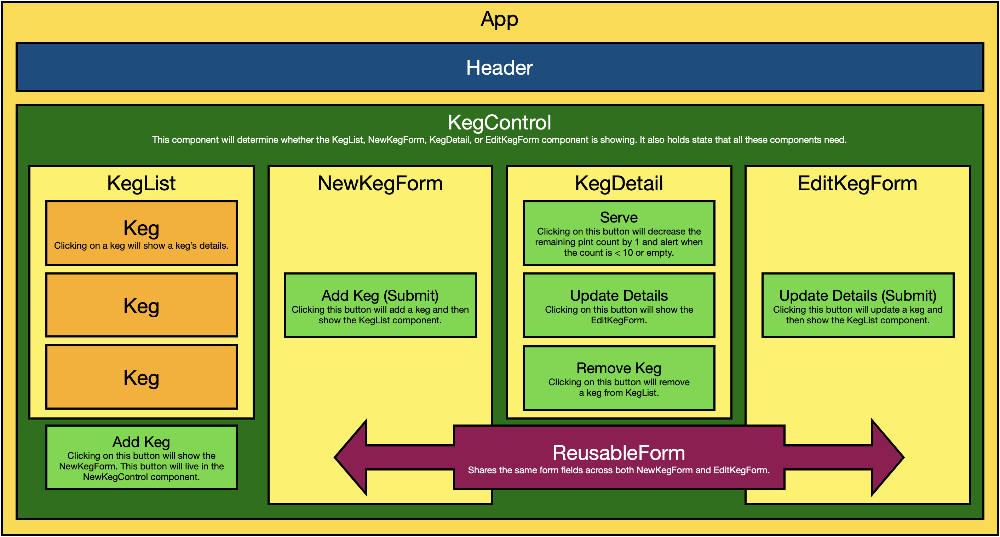

# The Witch's Broom
## _A Keg Inventory Manager_
### by: Micah L. Olson
### created: 4/23/2021

--- 

## Description
This application is a keg inventory manager for The Witch's Broom Tap Room providing the following user features:  
* Users can see a list of all available kegs along with their name, brand, price and alcoholContent.
* Users can submit a form to add a new keg to the list.
* Users can click on a keg to see its detail page.
* On the detail page, users can track when they serve a pint and see a keg's remaining content.
* Users can update a keg's details after entering them.
* Users can remove a keg from the list.
* If a keg is low on remaining pints, a user will be alerted to order more.
* If a keg is empty, a keg's contents will display as "out of stock".

---

## Technologies Used
* React
* JavaScript
* JSX
* HTML
* CSS
* Node.js
* npm
* Markdown
* git

---

## Component Diagram


---

## Installation and Setup
* You will need to use your system's **`terminal` emulator** to set up and locally use this application.

* **Clone this repository** to a local directory using the command-line tools `cd` and `git`.  
  <small>
    ([how to install git](https://www.learnhowtoprogram.com/introduction-to-programming/getting-started-with-intro-to-programming/git-and-github))
  </small>
  ```bash
  $ cd ~/<local_directory>/
  $ git clone https://github.com/MicahOlson/witch-broom.git
  ```

* **Navigate to the top level directory** of the cloned repository.  
  ```bash
  $ cd witch-broom/
  ``` 

* **Install all application dependencies** using the `Node Package Manager` (`npm`).
  ```bash
  $ npm install
  ```

* **Launch a local web server** to interact with the application in a browser.
  ```bash
  $ npm start
  ```

  * IMPORTANT! Be sure to **shut the server down** when you are done using the app.  
    `control-c`

* If it doesn't launch automatically, type **localhost:3000** into your browser's address bar and hit `enter`.

---

## Code Editors
* **Recommendations** if you would like to utilize a **GUI** for opening or editing this application's files:
  * [Visual Studio Code](https://code.visualstudio.com) - "Code editing. Redefined."
  * [Atom](https://atom.io) - "A hackable text editor for the 21st Century."
  * [SublimeText](https://www.sublimetext.com) - "A sophisticated text editor for code, markup and prose."

---

## Notes, Bugs, Fixes, and Future Improvements
* No known bugs.
* There are no feature enhancements scheduled for this application.
* If you find a bug, please report it at the email address below.

---

## License
[MIT](https://choosealicense.com/licenses/mit/)  
Copyright &copy; 2021 Micah L. Olson

---

## Contact
Micah via [email](mailto:micah.olson@protonmail.com) | [LinkedIn](https://www.linkedin.com/in/micah-lewis-olson/) | [GitHub](https://github.com/MicahOlson)
